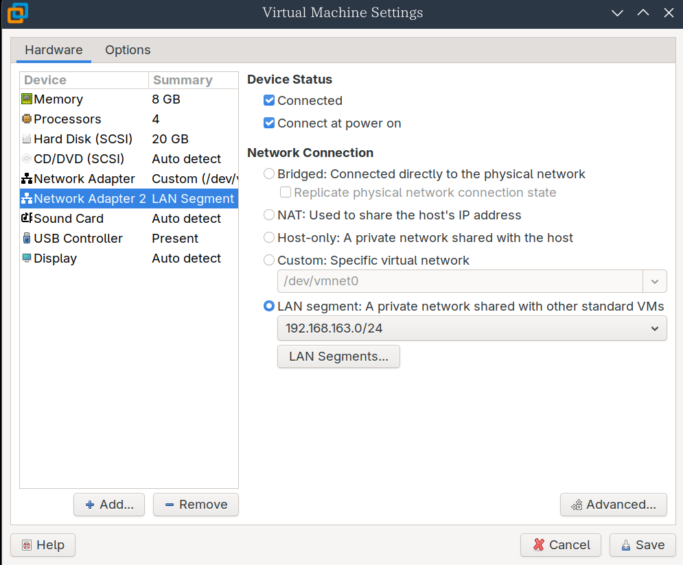

## Windows

Windows下载iso镜像后制作安装介质,可以使用Ventoy集成多个PE系统或系统镜像
Ventoy 是一个用于制作可启动 U 盘的开源工具。它的独特之处在于允许用户将ISO、WIM、IMG、VHD(x)、EFI等多种类型的系统镜像文件直接拷贝到 U 盘中直接使用，而无需进行额外的格式化或分区操作。用户可以一次性拷贝多个不同类型的镜像文件到同一个启动盘中，Ventoy 会在启动时提供一个菜单供用户选择。
参考:
- [使用Ventoy集成多PE打造强大U盘](https://blog.talen.top/posts/a595b813/index.html)
- [UEFI模式安全启动操作说明](https://www.ventoy.net/cn/doc_secure.html)
## Linux
### centos 7.9
#### 修改网络配置
添加一个新的网卡用于内网
创建配置文件`/etc/sysconfig/network-scripts/ifcfg-eth1`:
```
TYPE=Ethernet   # 网络类型
BOOTPROTO=none  # 获取静态IP的方式
NAME=eth1       # 名称
DEVICE=eth1     # 名称
ONBOOT=yes      # 开机自启
IPADDR=172.16.1.200 # IP地址
PREFIX=24       # 子网掩码
```
(``/etc/sysconfig/network-scripts/ifcfg-eth0`文件如下):
```
TYPE=Ethernet
BOOTPROTO=none
NAME=eth0
DEVICE=eth0
ONBOOT=yes
IPADDR=10.0.0.200
PREFIX=24
GATEWAY=10.0.0.2    # 网关
DNS1=223.5.5.5      # DNS服务器
```
配置完后需要重启网络服务:
```
systemctl restart network
```
然后就可以看到eth1的IP了:
```
ip add
1: lo: <LOOPBACK,UP,LOWER_UP> mtu 65536 qdisc noqueue state UNKNOWN group default qlen 1000
    link/loopback 00:00:00:00:00:00 brd 00:00:00:00:00:00
    inet 127.0.0.1/8 scope host lo
       valid_lft forever preferred_lft forever
    inet6 ::1/128 scope host
       valid_lft forever preferred_lft forever
2: eth0: <BROADCAST,MULTICAST,UP,LOWER_UP> mtu 1500 qdisc pfifo_fast state UP group default qlen 1000
    link/ether 00:0c:29:4d:6a:ce brd ff:ff:ff:ff:ff:ff
    inet 10.0.0.200/24 brd 10.0.0.255 scope global noprefixroute eth0
       valid_lft forever preferred_lft forever
    inet6 fe80::20c:29ff:fe4d:6ace/64 scope link
       valid_lft forever preferred_lft forever
3: eth1: <BROADCAST,MULTICAST,UP,LOWER_UP> mtu 1500 qdisc pfifo_fast state UP group default qlen 1000
    link/ether 00:0c:29:4d:6a:d8 brd ff:ff:ff:ff:ff:ff
    inet 172.16.1.200/24 brd 172.16.1.255 scope global noprefixroute eth1
       valid_lft forever preferred_lft forever
    inet6 fe80::20c:29ff:fe4d:6ad8/64 scope link
       valid_lft forever preferred_lft forever
```
#### 开放root登录
编辑`/etc/ssh/sshd_config`文件,取消下面两行的注释
```
PermitRootLogin yes
PasswordAuthentication yes
```
#### 更换阿里云yum源
```
# 备份
sudo mkdir -p /etc/yum.repos.d/backup
sudo mv /etc/yum.repos.d/CentOS-*.repo /etc/yum.repos.d/backup/
# 基础源
sudo curl -o /etc/yum.repos.d/CentOS-Base.repo https://mirrors.aliyun.com/repo/Centos-7.repo
# EPEL扩展源
sudo curl -o /etc/yum.repos.d/epel.repo https://mirrors.aliyun.com/repo/epel-7.repo

sudo yum clean all        # 清理旧缓存
sudo yum makecache fast   # 生成新缓存

# 验证是否生效
sudo yum repolist
```
### Ubuntu22.04
#### 修改网络配置
在ubuntu22.04中网络配置已从传统的 `ifcfg` 文件迁移到 **Netplan** 系统,网络配置文件位于 `/etc/netplan/` 目录,默认存在一个`50-cloud-init.yaml`:
```
# This file is generated from information provided by the datasource.  Changes
# to it will not persist across an instance reboot.  To disable cloud-init's
# network configuration capabilities, write a file
# /etc/cloud/cloud.cfg.d/99-disable-network-config.cfg with the following:
# network: {config: disabled}
network:
    ethernets:
        ens33:
            addresses:
            - 10.0.0.80/24
            nameservers:
                addresses:
                - 223.5.5.5
                search: []
            routes:
            -   to: default
                via: 10.0.0.2
    version: 2
```
按照文档注释,需要新建一个`/etc/cloud/cloud.cfg.d/99-disable-network-config.cfg`文件才能在重启后不自动使用配置
```
sudo vim /etc/cloud/cloud.cfg.d/99-disable-network-config.cfg

network: {config: disabled}
```
把`50-cloud-init.yaml`重命名为`50-cloud-init.yaml.bak`(或者直接删除)
然后创建自己的网络配置文件:
```
vim /etc/netplan/01-static-config.yaml
network:
  ethernets:
    ens33:
      dhcp4: no
      addresses:
        - 11.0.0.80/24
      routes:
        - to: default
          via: 11.0.0.1
      nameservers:
        addresses: [223.5.5.5]
  version: 2
```
重新生成和使用配置:
```
netplan generate

netplan apply

ip address
1: lo: <LOOPBACK,UP,LOWER_UP> mtu 65536 qdisc noqueue state UNKNOWN group default qlen 1000
    link/loopback 00:00:00:00:00:00 brd 00:00:00:00:00:00
    inet 127.0.0.1/8 scope host lo
       valid_lft forever preferred_lft forever
    inet6 ::1/128 scope host 
       valid_lft forever preferred_lft forever
2: ens33: <BROADCAST,MULTICAST,UP,LOWER_UP> mtu 1500 qdisc fq_codel state UP group default qlen 1000
    link/ether 00:0c:29:ad:9c:33 brd ff:ff:ff:ff:ff:ff
    altname enp2s1
    inet 11.0.0.80/24 brd 11.0.0.255 scope global ens33
       valid_lft forever preferred_lft forever
    inet6 fe80::20c:29ff:fead:9c33/64 scope link 
       valid_lft forever preferred_lft forever
```
##### 新增一个网卡并配置
在虚拟机中新增了一个网卡:

查看新的网卡名:
```
ip address
1: lo: <LOOPBACK,UP,LOWER_UP> mtu 65536 qdisc noqueue state UNKNOWN group default qlen 1000
 link/loopback 00:00:00:00:00:00 brd 00:00:00:00:00:00
 inet 127.0.0.1/8 scope host lo
    valid_lft forever preferred_lft forever
 inet6 ::1/128 scope host 
    valid_lft forever preferred_lft forever
2: ens33: <BROADCAST,MULTICAST,UP,LOWER_UP> mtu 1500 qdisc fq_codel state UP group default qlen 1000
 link/ether 00:0c:29:9f:d3:7c brd ff:ff:ff:ff:ff:ff
 altname enp2s1
 inet 11.0.0.80/24 brd 11.0.0.255 scope global ens33
    valid_lft forever preferred_lft forever
 inet6 fe80::20c:29ff:fe9f:d37c/64 scope link 
    valid_lft forever preferred_lft forever
3: ens37: <BROADCAST,MULTICAST,UP,LOWER_UP> mtu 1500 qdisc fq_codel state UP group default qlen 1000
 link/ether 00:0c:29:9f:d3:86 brd ff:ff:ff:ff:ff:ff
 altname enp2s5
    valid_lft forever preferred_lft forever
 inet6 fe80::20c:29ff:fe9f:d386/64 scope link 
    valid_lft forever preferred_lft forever
```
网卡名是`ens37`
然后在配置文件`/etc/netplan/01-static-config.yaml`给该网卡配置IP:
```
network:
ethernets:
 ens33:
   dhcp4: no
   addresses:
        - 11.0.0.80/24
      routes:
        - to: default
          via: 11.0.0.1
      nameservers:
        addresses: [223.5.5.5]
    # 需要使用 ip address 指令查看新建的网卡名
    ens37:
      dhcp4: no
      addresses:
        - 192.168.163.80/24
  version: 2
```
应用即可:
```
netplan generate

netplan apply
```
##### 修改软件源
修改下列文件中的源地址:
```
vim /etc/apt/sources.list

deb https://mirrors.aliyun.com/ubuntu/ jammy main restricted universe multiverse
deb-src https://mirrors.aliyun.com/ubuntu/ jammy main restricted universe multiverse

deb https://mirrors.aliyun.com/ubuntu/ jammy-security main restricted universe multiverse
deb-src https://mirrors.aliyun.com/ubuntu/ jammy-security main restricted universe multiverse

deb https://mirrors.aliyun.com/ubuntu/ jammy-updates main restricted universe multiverse
deb-src https://mirrors.aliyun.com/ubuntu/ jammy-updates main restricted universe multiverse

# deb https://mirrors.aliyun.com/ubuntu/ jammy-proposed main restricted universe multiverse
# deb-src https://mirrors.aliyun.com/ubuntu/ jammy-proposed main restricted universe multiverse

deb https://mirrors.aliyun.com/ubuntu/ jammy-backports main restricted universe multiverse
deb-src https://mirrors.aliyun.com/ubuntu/ jammy-backports main restricted universe multiverse
```
可以从[Ubuntu镜像源](https://developer.aliyun.com/mirror/ubuntu)找到各个版本的源
